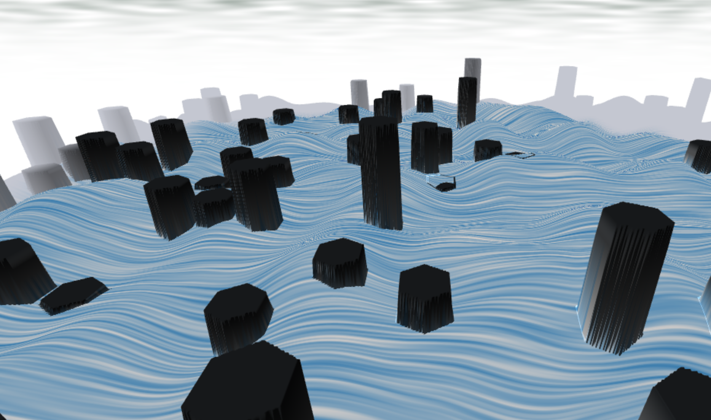
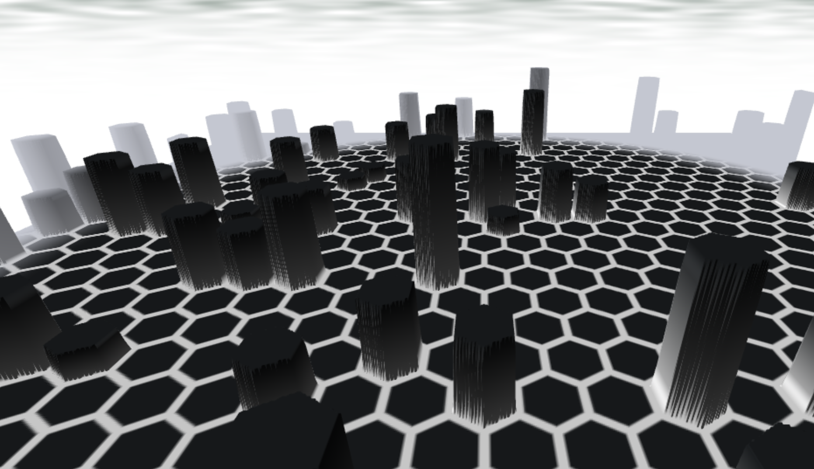
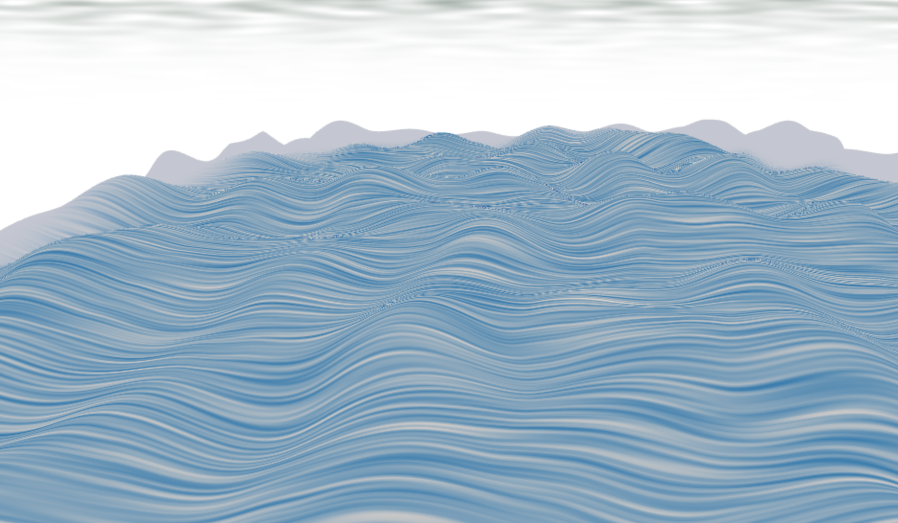

# CIS 566 Homework 1: Noisy Terrain

## Overview

Matthew Riley
PennKey: matriley
Live at: https://mgriley.github.io/hw01-noisy-terrain/

External sources:
I referred to the following articles on Inigo Quilez's website:
http://iquilezles.org/www/articles/distfunctions2d/distfunctions2d.htm
http://iquilezles.org/www/articles/functions/functions.htm

## Description:

The rendering is done in several stages, with each stage modifying a StageState data-structure contained the most recent data (height, color, normal, etc.) and passing it to the next stage. This allows subsequent stages to adapt to changes made in earlier stages. I only ended up using two stages. The first stage generates the height-map for the hexagon spires. To do some, it translates the plane position into a 2d space tiled by hexagons, find the center of the nearest hexagon, and uses a 2d sdf to detect if it is contained in the hexagon. The height and frequency of the hexagonal tiles is determined by a smooth 2d noise function. 
The second stage sets the height of the wave-like substance. It first reads the height from the StageState structure. If it is 0, we know that no hexagonal tile was drawn in the previous stage, so we can set the height to the height of a wave without overriding previously set heights. I used surface-let based 2d noise to set the height. That is, the height is the distance-weighted average of the position of the plane point on several different slopes/hills, where each hill corresponds to a 2d vector (giving the gradient) at a surrounding grid point.  
The sky uses the same surface-let noise as stage 2, with a simple animation to pan the clouds across the horizon.

## Stage 1 - Hexagonal Tiles

## Stage 2 - Slopes

